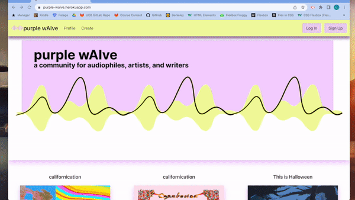
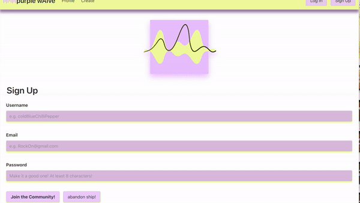
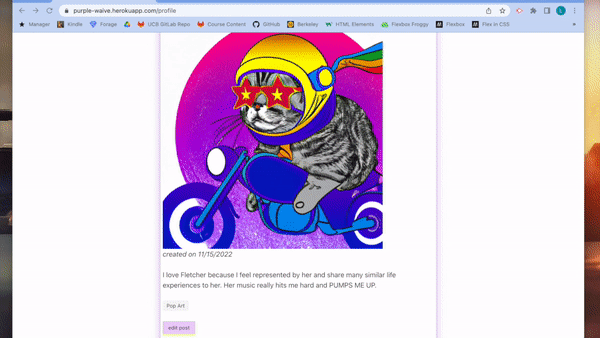
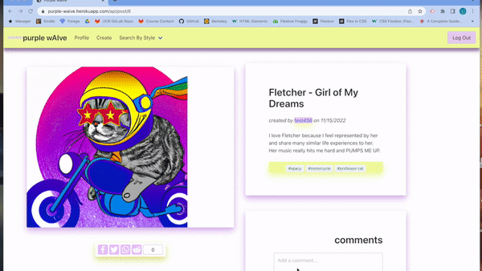
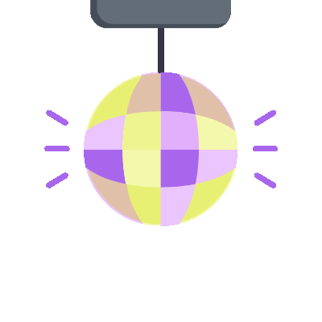

# Purple wAIve

## Description

Did you listen to a song today that made you feel a certain way, but want to express it in a new and fun way? Do you want to join a community of like-minded music lovers? If yes, Then Purple wAIve is perfect for you! Purple wAIve is a webpage built for audiophiles, artists, writers or really anyone who likes music and artistic expression. Purple wAIve uses DALLE2's artifical intellingence system to generate pictures based on user input.The AI generated images offer an expansion of the scope of artistic expression since most humans would not think to create an image/picture the same as an AI system that has millions and millions of pictures/images to reference all at a moments notice.

[Click here for a link to the deployed app!](https://purple-waive.herokuapp.com)

## Table of Contents

- [Description](#Description)
- [Usage](#Usage)
- [Features](#Features)
- [Code-Snippets](#Code-Snippets)
- [Authors](#Authors)
- [Contributing-Guidlines](#Contributing-Guidlines)
- [Questions](#Questions)
- [License](#License)

 

## Usage

First, download the dependencies by running "npm install", next go into mysql shell and import the schema files by running "source db/schema.sql" and then exit the shell. Run "npm run seed" in the terminal and next go to the command line in the folder that holds your server.js file. Finally, type "node server.js" and click enter. Click on the URL in the terminal to open the webpage.To start posting, reading and adding comments, you will need to be logged in. Sign-up if you haven't already and make your first Blogspot post and connect with the community!

We also have a dummy account set up if you'd like to use that to login & checkout our features: 

> username: dummyAccount

> email: dummyAccount@gmail.com

> password: dummyAccount1!

## Features

# Homepage

this is what the homepage will look like to some one eho is no logged. They can see the most recent post but cannot open it, they will to sign in.

# user login/signup and logout

so we have a validated signup and login system in place so that user who sign up can see all posts, comment on othe posts and create their own posts.

Purple wAIve has a ton of user validation to ensure that the user experience is as pleasant as can be. Below we have 3 validations for the signup page, ensuring that the user input a strong password, correct email and an original username.

Below is another example of validations we have. If the user is not logged in, then they will not be able to create an image or interact with posts.This helps ensure that we can get a dedicated user base.

# session storage

we used expression session to store user data into cookie, so that the logged in status peresists

# create new art

Logged in users can create new art by clicking on the create tab in the navbar and from there are prompted to enter the title of song, keywords about how the song made them feel/think, style of the art and a body where they can write a more detailed story.

# Share your favorite post to twiter and reddit!

# Engange witha community of music lovers by leaving them a comment on their post

To create a new image using the DALLE2 AI system the logged in user can go to our create page

## License

Licensed under the MIT license.[License details here](https://opensource.org/licenses/MIT)

## Built With

- 
- 
- 
- 
- 
- 
- 
- 
- 
- 
- 
- mysql2
- dotenv
- expression-session

## Code Snippets 
We utilized the Dalle2.0 API offered by openai:

To get around the epheremal filesystem of heroku, we utilized cloudinary to upload the image saved to a cloud storage for persistant storage:

## Authors

**Chris Gibson**

- [GitHub](https://github.com/chrischarlesgibson)
- [Linkedin](https://www.linkedin.com/in/chris-gibson-415909250/)
- [Portfolio](https://chrischarlesgibson.github.io/Chris-Gibson-project-portfolio/)

**Laura Duffy**

**Mari Ma**

[Icon credit @ Anton Kalashnyk](https://icon-icons.com/users/14quJ7FM9cYdQZHidnZoM/icon-sets/)

**Akash Chanara**

- [GitHub](https://github.com/akash2040)
- [Linkedin](https://www.linkedin.com/in/akash-chanara-087b531ab)
- [Portfolio](https://akash2040.github.io/portfolio-akash/)

## Contributing Guidlines

If you would like to contribute to this app, please contact Laura at lauraduffy700@gmail.com and we can discuss further.

## Questions

For any questions, please reach out by creating an issue.
